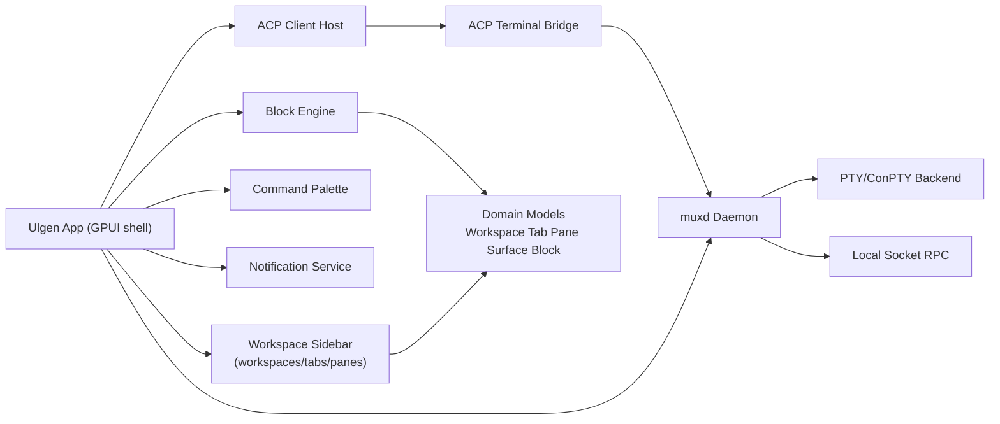

# Ulgen

Ulgen is an open source, native desktop terminal platform inspired by modern block-based workflows and tmux-grade session control.

Ulgen v1 goals:
- Native app targets: macOS, Linux, Windows
- Workspace-centric navigation with hierarchy: `workspace -> tabs -> panes`
- Block-first terminal experience as a core primitive
- Hybrid ctmux/cmux runtime (`muxd`) with persistent sessions and socket API
- ACP client-host support for external agents with gated terminal control
- In-app and OS-level notifications

## Why Ulgen

Traditional terminals are powerful but fragmented across shell history, panes, and external multiplexers. Ulgen combines:
- modern command blocks
- native multiplexer semantics
- agent interoperability through ACP
- production-ready OSS governance and contribution standards

## Architecture (v1)



## Platform Support Matrix

| Platform | Native target | PTY backend |
|---|---|---|
| macOS | Yes (v1) | Unix PTY adapter |
| Linux | Yes (v1) | Unix PTY adapter |
| Windows | Yes (v1) | ConPTY adapter |

## Repo Layout

- `apps/ulgen-app`: app entrypoint and top-level state shell
- `crates/ulgen-domain`: canonical domain types
- `crates/ulgen-settings`: stable settings contract
- `crates/ulgen-notify`: notification bus and event contracts
- `crates/ulgen-pty`: terminal backend abstraction (PTY/ConPTY)
- `crates/ulgen-muxd`: multiplexer daemon model and RPC contract
- `crates/ulgen-acp`: ACP lifecycle and terminal bridge interfaces
- `crates/ulgen-command`: command palette action registry
- `docs/rpc/muxd.md`: socket RPC contract draft
- `docs/milestones.md`: implementation milestones and sub-issues

## Quickstart

### Prerequisites

- Rust stable toolchain (`cargo`)

### Build

```bash
cargo build
```

### Test

```bash
cargo test
```

### Run smoke shell

```bash
cargo run -p ulgen-app -- --smoke
```

## Milestones and Tracking

Milestones are mirrored 1:1 between Linear and GitHub:
- `M0 - OSS & Tracking Bootstrap`
- `M1 - Native Platform Core`
- `M2 - Hybrid ctmux/cmux Engine`
- `M3 - Essential Block UX + Sidebar Navigation`
- `M4 - ACP Host + Terminal App Control`
- `M5 - Themes, Pointer, Polish, Beta`

Detailed sub-issues are documented in [docs/milestones.md](docs/milestones.md).
Linear tracking links are in [docs/tracking.md](docs/tracking.md).

### Bootstrap GitHub milestones

If you want to create mirrored GitHub milestones from this repo:

```bash
export GITHUB_TOKEN=your_token_with_repo_scope
./scripts/create_github_milestones.sh
```

You can override the target repo with `OWNER` and `REPO` env vars.

## Screenshots

Screenshots and demos will be added during M3 and M5.

## OSS

Ulgen is open source under the Apache License 2.0.

- License: [LICENSE](LICENSE)
- Security policy: [SECURITY.md](SECURITY.md)
- Contribution guide: [CONTRIBUTING.md](CONTRIBUTING.md)
- Code of Conduct: [CODE_OF_CONDUCT.md](CODE_OF_CONDUCT.md)
