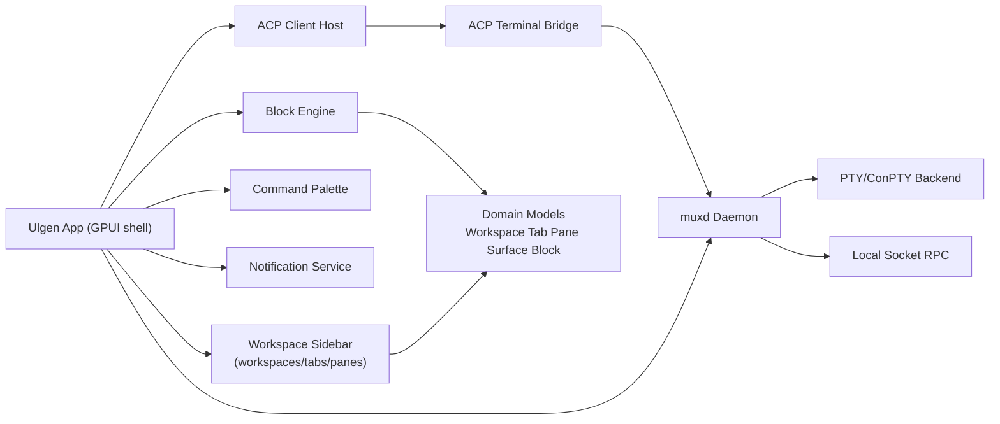

# Ulgen

Ulgen is an open source, native desktop terminal platform inspired by modern block-based workflows and tmux-grade session control.

## Vision

Ulgen v1 goals:
- Native desktop support for macOS, Linux, and Windows
- Workspace-first navigation: `workspace -> tabs -> panes`
- Block-based terminal UX as a core primitive
- Hybrid ctmux/cmux runtime (`muxd`) with persistent sessions and socket API
- ACP client-host interoperability with gated terminal control
- In-app and OS-native notifications

## Why Ulgen

Traditional terminal workflows split context across shell history, multiplexer state, and external tools. Ulgen brings those parts together:
- block-first command history and replay
- native multiplexer semantics
- ACP-aware agent workflows with approvals
- strong OSS governance and contributor workflow

## Architecture (v1)



## Platform Support Matrix

| Platform | Native target | Terminal backend |
|---|---|---|
| macOS | Yes (v1) | Unix PTY adapter |
| Linux | Yes (v1) | Unix PTY adapter |
| Windows | Yes (v1) | ConPTY adapter |

## Quickstart

### Prerequisites

- Rust stable toolchain (`cargo`)

### 1) Build

```bash
cargo build
```

### 2) Test

```bash
cargo test
```

### 3) Run smoke shell

```bash
cargo run -p ulgen-app -- --smoke
```

Expected result includes:
- `Smoke OK: sidebar=Left, keymap=Warp, windows=2, active_window_workspaces=2.`

## Repository Layout

- `apps/ulgen-app`: app entrypoint and shell state orchestration
- `crates/ulgen-domain`: canonical domain entities and state types
- `crates/ulgen-settings`: settings schema and defaults
- `crates/ulgen-notify`: notification bus contracts
- `crates/ulgen-pty`: PTY/ConPTY abstraction layer
- `crates/ulgen-muxd`: multiplexer daemon model and RPC handling
- `crates/ulgen-acp`: ACP lifecycle and terminal bridge interfaces
- `crates/ulgen-command`: command palette registry
- `docs/rpc/muxd.md`: muxd socket RPC contract draft
- `docs/milestones.md`: milestone and sub-issue plan

## Roadmap and Tracking

Milestones are mirrored 1:1 between Linear and GitHub.

| Milestone | Focus |
|---|---|
| M0 | OSS and tracking bootstrap |
| M1 | Native platform core |
| M2 | Hybrid ctmux/cmux engine |
| M3 | Block UX and sidebar navigation |
| M4 | ACP host and terminal app control |
| M5 | Themes, pointer/input polish, beta readiness |

Tracking links:
- Milestones and sub-issues: [docs/milestones.md](docs/milestones.md)
- Linear project and issues: [docs/tracking.md](docs/tracking.md)

To bootstrap mirrored GitHub milestones from this repo:

```bash
export GITHUB_TOKEN=your_token_with_repo_scope
./scripts/create_github_milestones.sh
```

You can override the target repository with `OWNER` and `REPO` environment variables.

## Screenshots

Screenshots and UI demos will be added during M3 and M5.

## OSS

Ulgen is licensed under Apache License 2.0.

- License: [LICENSE](LICENSE)
- Security policy: [SECURITY.md](SECURITY.md)
- Contribution guide: [CONTRIBUTING.md](CONTRIBUTING.md)
- Code of Conduct: [CODE_OF_CONDUCT.md](CODE_OF_CONDUCT.md)
- Agent workflow rules: [AGENTS.md](AGENTS.md)
